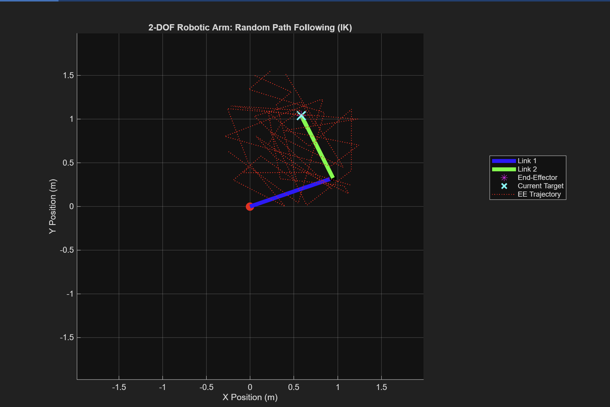

# 2-DOF Planar Robotic Arm: Kinematics & Path Following (MATLAB)

This project simulates and visualizes the movement of a 2-Degree-of-Freedom (2-DOF) planar robotic arm. It demonstrates the implementation of both **Forward Kinematics (FK)** and **Inverse Kinematics (IK)** to enable the arm to follow arbitrary paths within its workspace.

The simulation provides a clear visual representation of how a robot translates joint angles into end-effector positions (FK) and, more importantly, how it determines the necessary joint angles to reach a desired target position (IK).

## Features

* **Forward Kinematics:** Calculates the end-effector's (X, Y) coordinates given the joint angles (θ1, θ2).
* **Inverse Kinematics:** Solves for the joint angles (θ1, θ2) required to reach a specified (X, Y) target coordinate.
    * Handles **reachability checks** (determines if a target is within the arm's physical limits).
    * Manages **multiple solutions** for IK (e.g., "elbow-up" vs. "elbow-down" configurations).
* **Dynamic Path Following:** Animates the robotic arm as it attempts to follow a series of randomly generated target points.
* **Trajectory Trace:** Plots the actual path traced by the end-effector during the animation.
* **Interactive Visualization:** Real-time graphical updates of the arm's links, joints, end-effector, and current target.
* **Modular Code:** Separates the core IK logic into a dedicated function (`solve_ik_2dof.m`).

## How It Works

The project leverages fundamental principles of robotic kinematics:

1.  **System Definition:** A 2-DOF planar arm is defined by its two link lengths (L1, L2) and two revolute joint angles (θ1, θ2).
2.  **Forward Kinematics (FK):** Uses basic trigonometry (sine and cosine functions) to compute the end-effector's position from the given joint angles.
    * `x_EE = L1 * cos(θ1) + L2 * cos(θ1 + θ2)`
    * `y_EE = L1 * sin(θ1) + L2 * sin(θ1 + θ2)`
3.  **Inverse Kinematics (IK):** Solves the inverse problem using a **geometric approach** (Law of Cosines and `atan2` function) to determine the joint angles required for a given end-effector position. It yields two possible solutions for most points in the workspace.
4.  **Path Generation:** A series of random (X, Y) coordinates are generated within a defined safe region of the arm's workspace to create a dynamic path.
5.  **Animation Loop:** For each point in the generated path:
    * The IK solver determines the necessary joint angles.
    * The arm's graphical representation is updated on the plot using `set()` commands.
    * A small `pause()` is introduced to control animation speed.
    * The end-effector's trace is continuously drawn.

## Getting Started
### Installation

1.  Clone this repository or download the `.zip` file.
2.  Unzip the contents to a folder on your computer.

### How to Run

1.  Open **MATLAB**.
2.  Navigate to the folder containing the project files (`dof2robotarm.m` and `solve_ik_2dof.m`) in MATLAB's "Current Folder" browser.
3.  Run the main script by typing `dof2robotarm()` in the Command Window and pressing Enter, or by clicking the "Run" button in the MATLAB Editor.

## Screenshots / Demo

## Contribution

Feel free to explore, modify, and improve the code. Suggestions for enhancements (e.g., adding more DOFs, trajectory smoothing, dynamic analysis, or a GUI) are welcome!

## 📄 License

This project is licensed under the MIT License - see the `LICENSE` file for details (you can add a LICENSE file later if you wish).

## 👤 Author

**Praneeth Krishna Palle**
